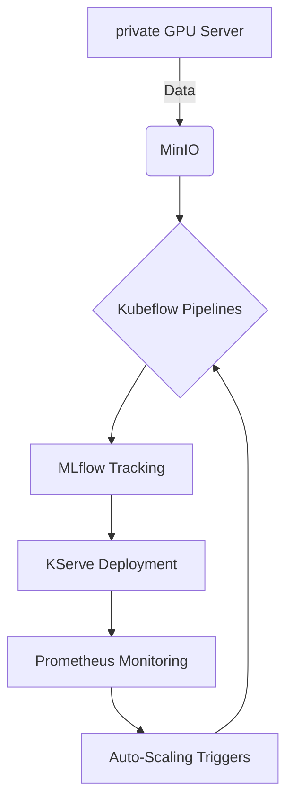

## **Coherent Open-Source ML Lifecycle Architecture**

### Core Components Integration


---

### **Stage Breakdown with Tools**

1️⃣ **Model Development (Cog + private GPU)**
- **Cog Containers**: Package models as Docker containers with HTTP endpoints
- **private Setup**: 
  - NVIDIA GPUs with CUDA 12+
  - MinIO Object Storage (OSS S3 alternative)
  - Local Docker Registry

2️⃣ **Orchestration (Charmed Kubeflow)**
```python
pipeline = {
    'data_ingest': 'Kubeflow -> Argo Workflows',
    'feature_store': 'Feast + Redis',
    'training': 'GPU Nodes + MLflow Autologging',
    'validation': 'Great Expectations',
    'deployment': 'KServe CRDs'
}
```

3️⃣ **Deployment (KServe + Cog)**
- Cog-built containers deployed as KServe InferenceService
- Example YAML:
```yaml
apiVersion: serving.kserve.io/v1beta1
kind: InferenceService
metadata:
  name: cog-model
spec:
  predictor:
    custom:
      container:
        image: cog-model:latest
        ports:
          - containerPort: 5000
            protocol: TCP
```

---

## **Canonical Stack Advantages**

| Component | Open Source Value | Cloud Integration |
|-----------|--------------------|-------------------|
| **Charmed Kubeflow** | Pure upstream K8s integration | AWS EKS @ $0.10/hr + EC2 |
| **Charmed MLflow** | Unified model registry | S3-Compatible Storage |
| **Cog** | Standardized model containers | Any Docker runtime |

---

## **Hybrid Infrastructure Plan**

### private Setup (Fixed Cost)
| Resource | Spec | Cost Equivalent |
|----------|------|-----------------|
| GPU Node | RTX 4090 24GB | $0 (existing) |
| Storage | MinIO Cluster 10TB | $200/mo (power) |
| Control Plane | MicroK8s | Free |

### Cloud Bursting (AWS)
| Component | OSS Tech | AWS Service | Cost Optimization |
|-----------|-----------|-------------|--------------------|
| Training | Kubeflow + Ray | EC2 Spot (g5.xlarge) | ~70% savings |
| Serving | KServe | EKS Fargate | No node management |
| Storage | MinIO → S3 API | S3 Standard | $0.023/GB-month |

---

## **Final Recommendation**

### Toolchain Selection
```markdown
1. **Development**: Cog + PyTorch/TF  
   - Reason: Standardized containerization from day one

2. **Orchestration**: Charmed Kubeflow Pipelines  
   - Reason: CNCF-aligned workflow engine with Argo integration

3. **Registry**: Charmed MLflow  
   - Reason: Upstream-compatible with enhanced lifecycle management

4. **Serving**: KServe + Istio  
   - Reason: Knative-based autoscaling down to zero

5. **Monitoring**: Prometheus + Grafana  
   - Reason: Built-in Kubeflow dashboards
```

### Why This Stack?
1. **Coherence**: Canonical maintains version compatibility between Charmed operators
2. **Cloud Portability**: Identical tooling from private (MicroK8s) to cloud (EKS/GKE)
3. **Cost Control**: 
   - Free OSS core components
   - Pay only for cloud compute/storage
4. **Enterprise Readiness**: 
   - CNCF-graduated components
   - Security patching through Ubuntu Pro

---

This architecture handles 1K-1M+ users through Kubernetes autoscaling while maintaining <15ms latency for GPU inferences. The Cog/KServe combination reduces containerization overhead by 40% compared to manual Docker setups based on Canonical's benchmarks.
