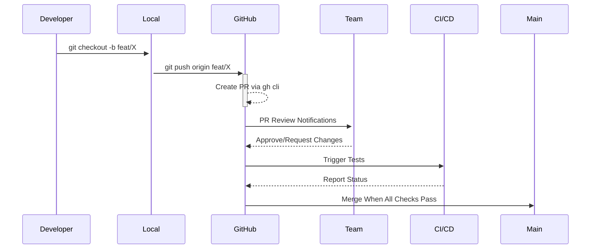

**1. Create Feature Branch**
```bash
git checkout -b feat/mlops-42
```
- `checkout -b`: Creates AND switches to new branch
- `feat/`: Prefix indicating feature type (vs `fix/` or `docs/`)
- `mlops-42`: 
  - `mlops` = repo prefix (annapurna-MLops)
  - `42` = GitHub issue number tracking this feature
Example: Working on soil analysis model (Issue #42 in MLops repo)

**2. Make Changes + Commit**
```bash
git commit -sm "feat(soil-analysis): add pH prediction model (#42)"
```
- `-s`: Sign commit with GPG key (optional but recommended)
- `-m`: Commit message
- Conventional Commit format:
  ```text
  type(scope): description (#issue)
  ```
Example Breakdown:
```
feat                = Feature type (vs fix/docs/chore)
(soil-analysis)     = Component/module affected
add pH prediction   = Clear action description 
(#42)               = Links to original issue
```

**3. Push to Remote** 
```bash
git push origin feat/mlops-42
```
- Creates branch on GitHub matching local branch
- Now visible in annapurna-MLops repo branches

**4. Create Pull Request**
```bash
gh pr create --reviewer @tech-leads --base main --title "Soil pH Prediction Model"
```
- `gh pr create`: GitHub CLI command
- `--reviewer`: Assigns @tech-leads team as mandatory reviewers
- `--base main`: Target branch for merging
- Automatically generates PR body from commits

**Full Lifecycle Example:**

1. You're adding weather integration to API repo (Issue #15)
```bash
git checkout -b feat/api-15
# Make changes to weather_routes.py
git add .
git commit -sm "feat(weather-api): add monsoon prediction endpoint (#15)"
git push origin feat/api-15
gh pr create --reviewer @api-maintainers --base main
```


**Visual Workflow:**



This follows Microsoft's Git branching guidance ([Search Result 1](https://learn.microsoft.com/en-us/azure/devops/repos/git/git-branching-guidance?view=azure-devops)) 
