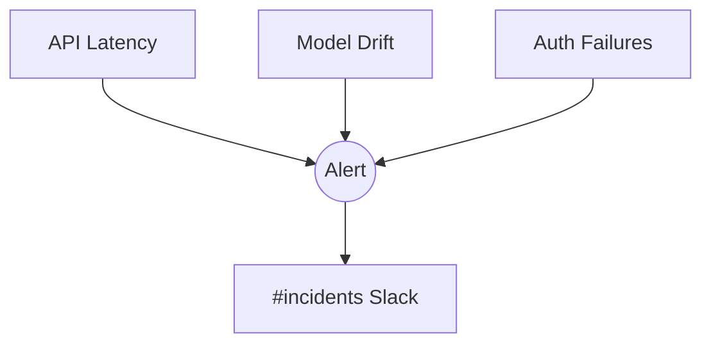

# Annapurna Decision Support System

**Organization Purpose**: agricultural intelligence system optimizing farming decisions through predictive analytics and real-time market data.

## Core Repositories

### 1. annapurna-docs
**Purpose**: Central documentation hub for technical specifications and contributor guidelines  
**Key Components**:
- `/architecture` (C4 diagrams & system context)
- `/onboarding` (DEV_ENVIRONMENT.md + CONTRIBUTING.md)
- `/api-specs` (OpenAPI 3.0 definitions)
- `/compliance` (GDPR/agricultural regulations)

**Access Control**:
- Read: Public
- Write: @docs-maintainers team
- Critical Integration Points: Links to code examples in other repos [1][6]

### 2. annapurna-infra
**Purpose**: Infrastructure-as-Code foundation  
**Key Components**:
- `/terraform` (Multi-cloud provisioning)
- `/github-actions` (Shared CI/CD workflows)
- `/monitoring` (Prometheus+Grafana configs)
- `/security` (Vault policies + RBAC templates)

**Access Control**:
- Read: Members
- Write: @devops-team
- Critical Integration: Cloud credential rotation every 90d [5]

### 3. annapurna-api
**Purpose**: Unified API gateway  
**Key Components**:
- `/proto` (gRPC service definitions)
- `/middleware` (Rate limiting/API key mgmt)
- `/versioning` (Semver release strategy)
- `/load-test` (Locust/K6 scenarios)

**Access Control**:
- Read: Public (excluding auth modules)
- Write: @api-developers
- Critical Integration: Schema validation contracts with MLops [2][7]

### 4. annapurna-application
**Purpose**: Farmer-facing interface  
**Key Components**:
- `/lib/l10n` (i18n language packs)
- `/voice` (STT/TTS integration logic)
- `/analytics` (Farmer usage tracking)
- `/testing` (Cypress E2E tests)

**Access Control**:
- Read: Public
- Write: @app-developers
- Critical Integration: A/B test framework hooks [3][8]

### 5. annapurna-MLops
**Purpose**: Machine learning lifecycle management  
**Key Components**:
- `/feature-store` (TSDB schemas)
- `/model-registry` (MLflow artifacts)
- `/drift-detection` (Statistical monitoring)
- `/pipelines` (Kubeflow/DAG templates)

**Access Control**:
- Read: Members
- Write: @ml-engineers
- Critical Integration: Model version webhooks [4]

## Future Scaling Repositories

| Repository Name       | Purpose                                  | Phase     |
|------------------------|------------------------------------------|-----------|
| annapurna-mobile-sdk   | Android/iOS native module integrations   | Phase 2   |
| annapurna-geospatial   | Satellite imagery processing            | Phase 3   |
| annapurnaIoT           | Sensor data ingestion pipeline          | Phase 2   |
| annapurna-analytics    | Farmer decision impact dashboard        | Phase 1   |
| annapurna-marketplace  | Agri-inputs transaction platform        | Phase 3   |
| annapurna-blockchain   | Supply chain provenance tracking         | Phase 4   |

## Critical Organization Practices

1. **Branch Protection Rules**
```yaml
required_pull_request_reviews:
  required_approving_review_count: 2
  require_code_owner_reviews: true
required_status_checks:
  contexts: ["lint-test-build", "security-scan"]
```

2. **Dependency Management**
- Weekly Dependabot scans across all repos [5]
- SBOM generation using CycloneDX

3. **Monitoring Matrix**



    
## Contribution Workflow

```bash
# Standard process across all repos
git checkout -b feat/[repo-prefix]-[issue#]
git commit -sm "feat([repo]): descriptive message (#123)"
gh pr create --reviewer @tech-leads 
```


